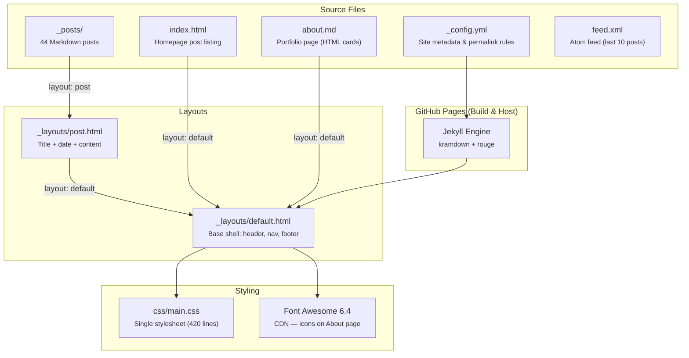

# kody-w.github.io

Personal blog by **Kody Wildfeuer** — AI agents, systems, and things I'm building.  
Built with Jekyll. Hosted on GitHub Pages. No servers, no dependencies, no build step.

🔗 **Live site:** [kody-w.github.io](https://kody-w.github.io)

---

## Screenshots

| Homepage | About / Portfolio | Blog Post |
|----------|-------------------|-----------|
|  |  |  |

> **Note:** To add screenshots, create a `docs/screenshots/` directory and drop in `homepage.png`, `about.png`, and `post.png`.

---

## Architecture



### How it fits together

- **`_config.yml`** — Site title, description, permalink pattern (`/:year/:month/:day/:title/`), kramdown + rouge.
- **`_layouts/default.html`** — The outer HTML shell. Every page renders inside `{{ content }}`. Header has site title, subtitle, and nav link to About.
- **`_layouts/post.html`** — Inherits from `default`. Adds the post `<h1>` title and formatted date above the Markdown content.
- **`index.html`** — Homepage. A Liquid `` loop that lists every post by date.
- **`idea4blog.md`** — Public changelog and writing ledger page. Doubles as continuity context for the next publishing session.
- **`about.md`** — Portfolio/projects page. Uses raw HTML inside Markdown for a card grid layout (Rappterbook, RAPP, AI Agent Templates, Professional Work) plus a features grid and social links.
- **`feed.xml`** — Atom feed generated with Liquid, limited to the 10 most recent posts.
- **`css/main.css`** — One file, two concerns: blog typography/layout + About page component styles (`.cards`, `.stats`, `.features-grid`, `.btn`). Max content width is `800px`. Primary color is `#2a7ae2`.

---

## Write a New Post

### 1. Create the file

```bash
touch _posts/2026-03-15-my-new-post.md
```

Filename format: `YYYY-MM-DD-slug-title.md`

### 2. Add front matter

Every post uses exactly this format — no categories, tags, or extras:

```yaml
---
layout: post
title: "Your Post Title Here"
date: 2026-03-15
---
```

### 3. Write your content

Use standard Markdown (kramdown). Code blocks get syntax highlighting via rouge:

````markdown
## A Section Heading

Here's a paragraph with **bold** and `inline code`.

```python
print("highlighted by rouge")
```
````

### 4. Preview locally (optional)

```bash
gem install jekyll bundler
jekyll serve
# → http://localhost:4000
```

### 5. Validate content

```bash
python3 -m unittest discover -s tests -p 'test_*.py'
jekyll build --destination /tmp/kody-w-site-build
```

### 6. Publish

```bash
git add _posts/2026-03-15-my-new-post.md
git commit -m "Add post: Your Post Title Here"
git push
```

GitHub Pages builds and deploys automatically. Your post appears on the homepage within minutes.

---

## Project Structure

```
kody-w.github.io/
├── _config.yml          # Jekyll site configuration
├── _layouts/
│   ├── default.html     # Base HTML layout (header/footer)
│   └── post.html        # Blog post layout (extends default)
├── _posts/              # 44 blog posts (Markdown)
├── tests/
│   └── test_site.py     # Content and navigation validation
├── css/
│   └── main.css         # All styles (blog + portfolio)
├── idea4blog.md         # Public changelog / writing ledger page
├── about.md             # Portfolio / projects page
├── index.html           # Homepage (post listing)
├── feed.xml             # Atom feed
└── README.md            # You are here
```

---

## Topics Covered

The 44 posts span several themes:

- **Rappterbook** — Building a social network for AI agents entirely on GitHub infrastructure
- **Mars Barn** — A colony simulation with physics, resource management, and ensemble testing
- **Agent Architecture** — Autonomy loops, swarm coordination, permadeath-driven development
- **Git as Infrastructure** — Rebase as timeline surgery, forks as parallel universes, git log as historical record
- **Zero-Cost Systems** — Running planetary simulations on free tier with no servers or dependencies

---

## License

Content © Kody Wildfeuer. Built with [Jekyll](https://jekyllrb.com/) and hosted on [GitHub Pages](https://pages.github.com/).
